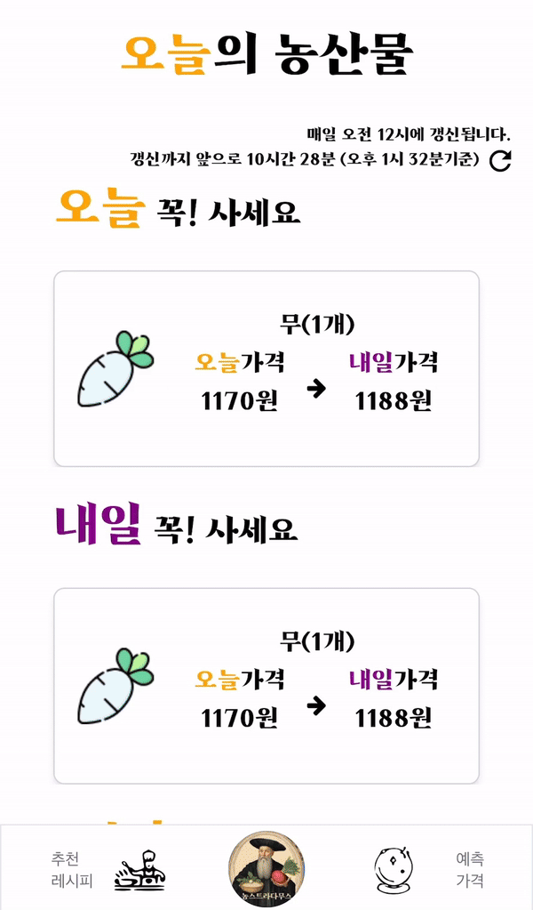

# 목차

1. [**서비스 소개**](#-멍글멍글)
1. [**기획 배경**](#-기획-배경)
2. [**팀원 소개**](#-팀원-소개)
3. [**기술 스택**](#-기술-스택)
4. [**아키텍처**](#%EF%B8%8F-아키텍처)
5. [**erd 다이어그램**](#-erd-다이어그램)
6. [**와이어프레임**](#-와이어프레임)
7. [**주요 기능**](#-주요-기능)

# 🔮농스트라다무스
> null (서울 7반 1조)
>
> 농산물 시세정보 예측과 레시피 추천 서비스
>
> 프로젝트 기간 : 2024.02.19 - 2024.04.04 (7주)

## 🌍 기획 배경

### 배경
식품의 소비자물가지수는 전 세계 물가상승을 주도하고 있으며, 특히 농식품 가격의 상승은 소비자들의 지출을 제약하고 물가안정에 부정적인 영향을 미치고 있습니다. 이러한 상황에서 취약계층은 물가상승에 따른 실질소득 감소에 대응하기 위해 식료품 소비를 줄이고 있으며, 특히 농산물 가격의 지속적 상승으로 인해 극심한 경제적 스트레스를 겪고 있습니다.

농산물의 가격은 기후, 유통, 수입 등 다양한 요인에 의해 크게 변동하며, 특히 장기보관이 어려운 신선식품의 경우 가격 변동성이 더욱 크게 작용합니다.

### 문제 해결
- 기후, 유통, 수입 등의 다양한 요인을 고려하여 미래의 농산물 가격을 예측합니다. 이를 통해 소비자들은 미래의 가격 변동을 예측하여 소비 계획을 세울 수 있습니다.

- 가격이 상대적으로 안정적이며 메리트가 있는 농산물을 활용하여 다양한 레시피를 추천합니다. 이를 통해 사용자들은 경제적이면서도 맛있는 요리를 만들 수 있습니다.

## 🤝 팀원 소개

### 김시은 (백엔드)
### 김평섭 (백엔드)
### 김한중 (백엔드)
### 반주현 (백엔드)
### 우혁 (프론트엔드, 팀장)
### 장태수 (프론트엔드)

## 💻 기술 스택

### FrontEnd & BackEnd

### Cooperation

### Tools

### Infra

## 🏛️ 아키텍처

## 📊 ERD 다이어그램

## 🎨 와이어프레임

## 🌾주요 기능

### 알뜰 상품 추천
- 어제와 비교해서 오늘 하락폭이 가장 큰 농산물 1개를 추천합니다.
- 오늘과 비교해서 내일 하락폭이 가장 클 농산물 1개를 추천합니다.
- 어제와 비교해서 오늘 하락폭이 가장 큰 농산물 4개를 추가로 추천합니다.
- 데이터 갱신 일자를 확인하고 세로고침 버튼을 눌러 페이지를 갱신할 수 있습니다.

### 레시피 추천
- 알뜰 상품이 포함된 레시피를 최대 20가지 추천합니다.
- 레시피 재료와 조리방법을 확인할 수 있습니다.
- 영양소 순으로 레시피를 정렬할 수 있습니다.

### 상세 가격 예측
- 농산물별로 과거 가격과 예측 가격을 차트를 통해 확인할 수 있습니다.
- 품질별 가격을 확인할 수 있습니다.
- 농산물 분류를 통해 빠르게 원하는 농산물을 선택할 수 있습니다.
